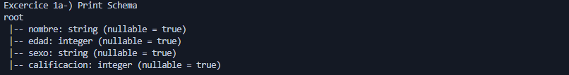
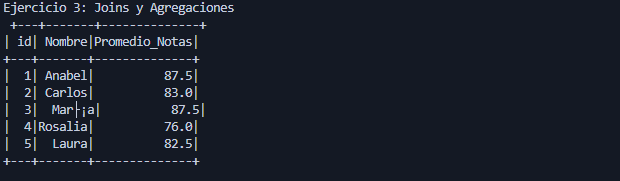

# KeepBDProcessing
MODULO Big Data Processing SCALA || SPARK

## TEST:
Crear un DataFrame y realiza operaciones básicas ,Pregunta: Crea un DataFrame a partir de una secuencia de tuplas 
que contenga información sobre estudiantes (nombre, edad, calificación). Realiza las siguientes operaciones:

## Exercise 1

a- Muestra el esquema del DataFrame.

b-Filtra los estudiantes con una calificación mayor a 8

c-Selecciona los nombres de los estudiantes y ordénalos por calificación de forma descendente

## Exercise 2 : UDF (User Defined Function)
Pregunta: Define una función que determine si un número es par o impar.
Aplica esta función a una columna de un DataFrame que contenga una lista de números.

## Exercise 3 : Joins y Agregaciones
Pregunta: Dado dos DataFrames, uno con información de estudiantes (id, nombre) y otro con calificaciones 
(id_estudiante, asignatura, calificacion), realiza un join entre ellos y calcula el promedio de calificaciones por estudiante.

## Exercise 4 :  Uso de RDDs
Pregunta: Crea un RDD a partir de una lista de palabras y cuenta la cantidad de ocurrencias de cada palabra.

## Exercise 5 :  Procesamiento de archivos
Pregunta: Carga un archivo CSV que contenga información sobre  ventas (id_venta, id_producto, cantidad, precio_unitario)
y calcula el ingreso total (cantidad * precio_unitario) por producto.

